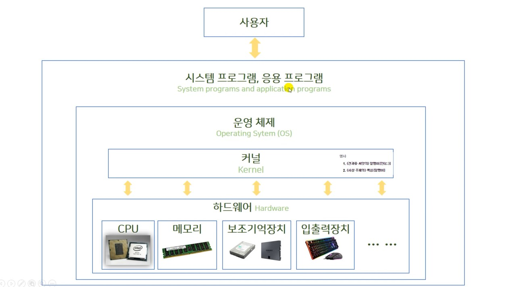

## 0.3 운영체제가 해주는 일들

---

### 운영체제

windows, MacOS, unix, linux, ios, android

---

사용자 - 시스템프로그램, 응용프로그램

하드웨어를 통해 입력을 해서 응용프로그램을 이용, 결과를 받는다

**커널** : 핵심(알맹이)

응용프로그램과 하드웨어를 중개해준다.

(하드웨어를 직접 다루기 어렵기 때문에)

컴퓨터의 **자원관리**도 운영체제가 한다.

프로그래머 매번 직접 개발할 필요없이, 인터페이스(도구)지원해주는 존재
