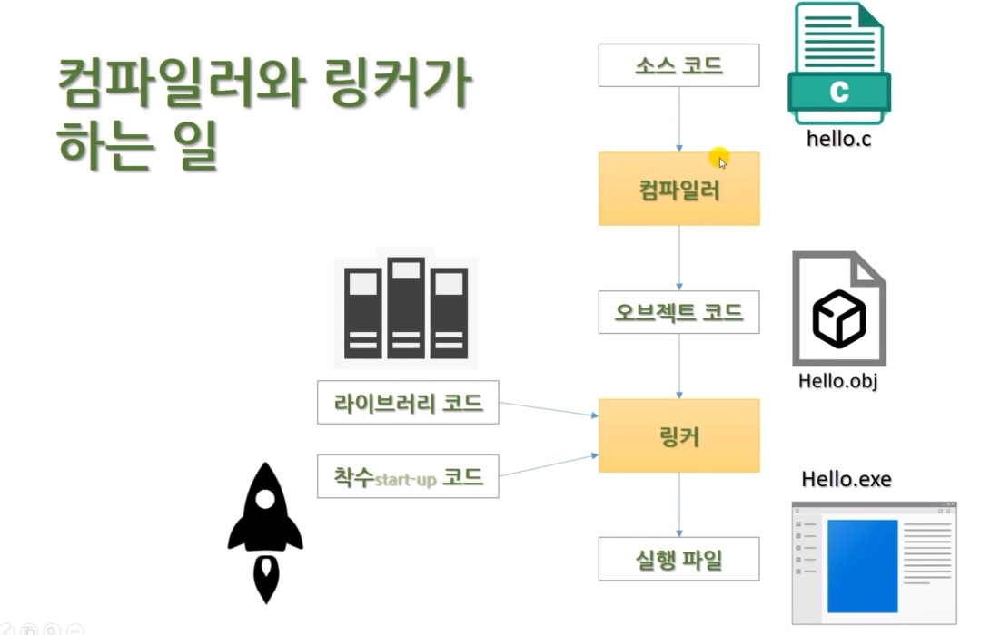

# 1.9 컴파일러와 링커

obj파일생성 (뒤에가서는 여러개 생성됨)

**링커**

obj파일이 여러개 있을 때 그것들을 엮어서(linking), 실행해 준다.

---

**라이브러리 코드**

내부적으로 포함되어있는 기능

(e.g.) 화면에 이런 글자를 출력해주세요,

링커가 라이브러리에서 찾아서 실행시켜준다.

---

**start-up 코드** (착수 코드)

프로그램이 시작할때마다, 공통적으로 해야 할 일

(e.g.) 처음 시작할 때 메모리를 할당해주세요,
